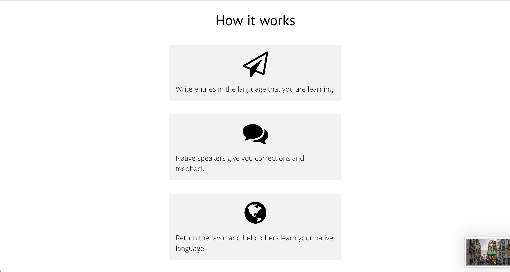
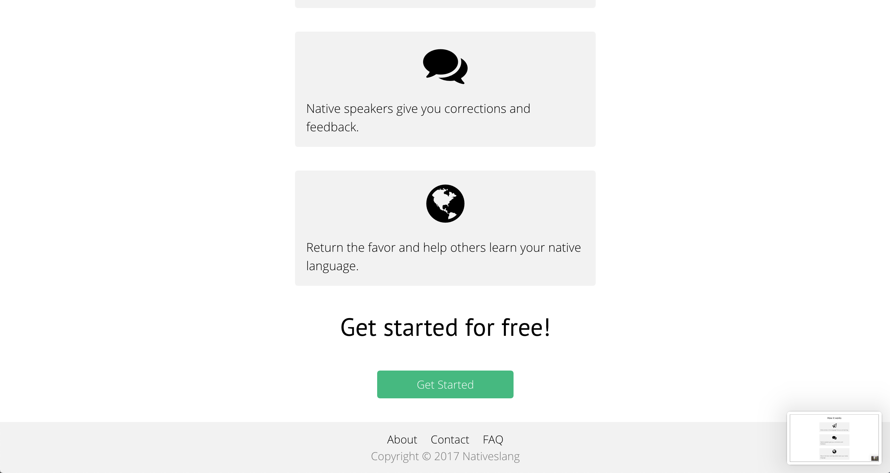
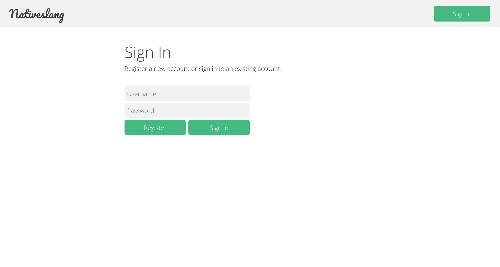
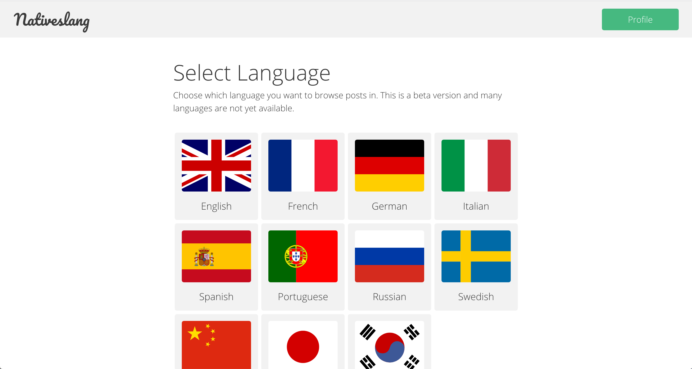
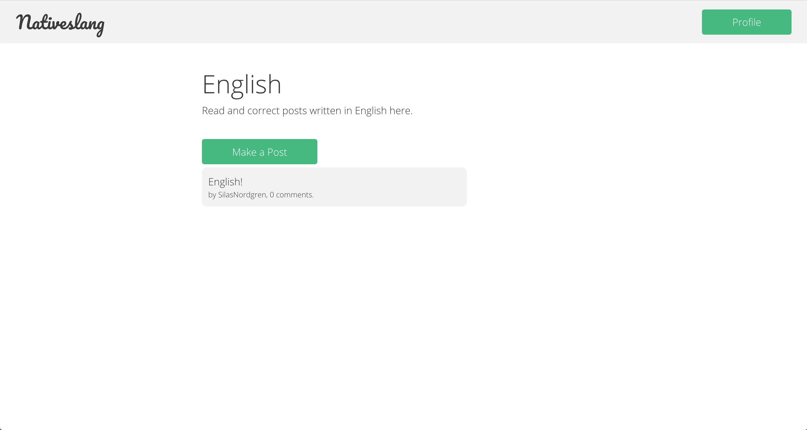
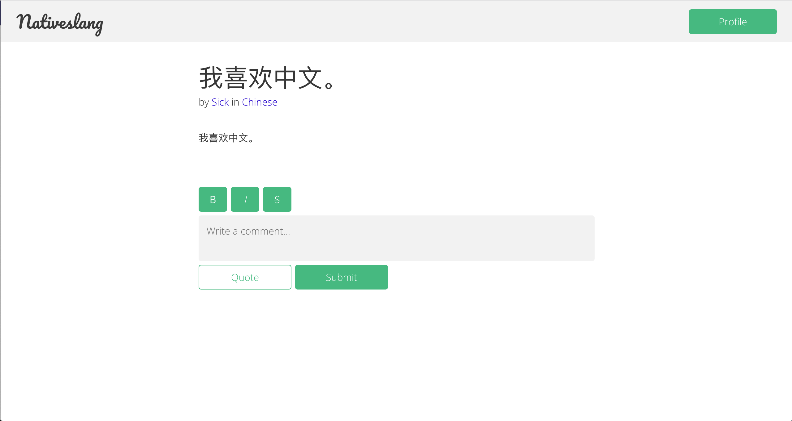
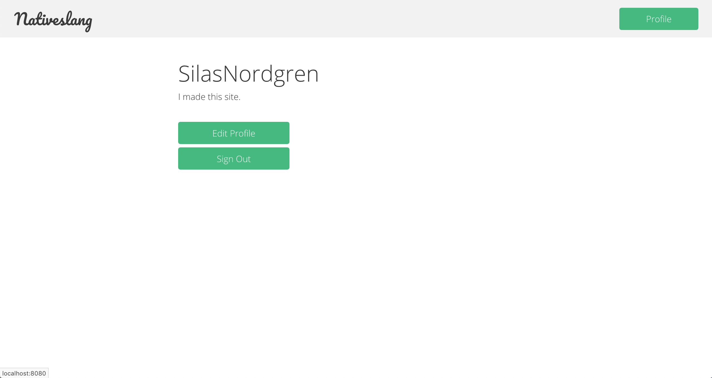

# nativeslang

The first website I ever wrote and designed. It's intended to give language learners a
place to give each other feedback on texts written in their target language.

The backend was written using Java, Spark Java (the web micro-framework), HSQLDB, and
j2html. If I had started this project today, I would not have used this stack.

While the backend isn't so impressive, I'm happy with the design.

